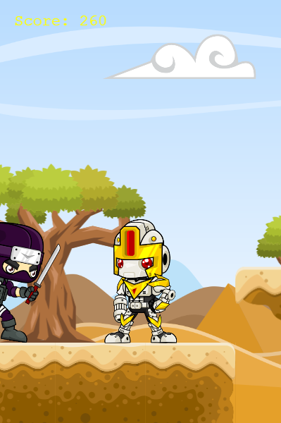

# Robot vs Ninja
> A game where you can eliminate the ninjas, using a robot with massive destruction weapows.



<br>This project was made to consolidate my knowledge with JS, and take a step ahead on game development world.<br>

## Content

* [Live Demo](#live-demo)
* [Requirements](#requirements)
* [Built With](#built-with)
* [Getting Start](#getting-start)
* [Contributing](#contributing)
* [Acknowledgments](#acknowledgments)
* [Author](#author)
* [License](#license)

## Live Demo
You can access a deployed version of this app:<br>
https://weather-app-007.web.app/

## Requirements
- [x] A modern web browser [Download page](https://www.google.com/chrome/)
- [x] Node (Get start with Node)[https://nodejs.org/en/download/]
- [x] Yarn (Get start with Yarn)[https://classic.yarnpkg.com/en/docs/install/#windows-stable]

## Pre-requisites
<ul>
	<li>Node</li>
	<li>Yarn</li>
	<li>Web browser</li>
</ul>

## Built With

- Javascript<br>
- Phaser 3 (Game Engine)<br>
- HTML/CSS <br>
- Webpack and babel <br>
- JEST for tests <br>
- ESlint and Stylelint (Linters) <br>
- GitHub Actions (CI Tool) <br>
- Git, Github and VScode <br>


## Setup

#### Get a local copy
Now you need a copy of this application, if you are using Git:
```js
git clone git@github.com:SevlaMare/robotGame.git
```
Otherwise just hit (Download Zip) on green button (Clone or Download) at top of this page.

#### Open terminal
Open your terminal inside the game folder, and paste the following commands:

#### Download all dependencies
```js
npm install
```

#### Compile
```js
yarn build
```

#### Start the server
```js
yarn go
```

#### Go to a web browser (Like Google Chrome) and visit:
```js
localhost:7000
```

### Contributing

Contributions, issues and feature requests are welcome!

You can do it on [issues page](issues/).

## Acknowledgments

A special thanks for the code reviewers.

## Author

👤 **Thiago Miranda**

- Github: [@SevlaMare](https://github.com/SevlaMare)
- Twitter: [#SevlaMare](https://twitter.com/SevlaMare)
- Linkedin: [SevlaMare](https://www.linkedin.com/in/sevla-mare)

### License
<strong>Creative Commons • 2020</strong>
